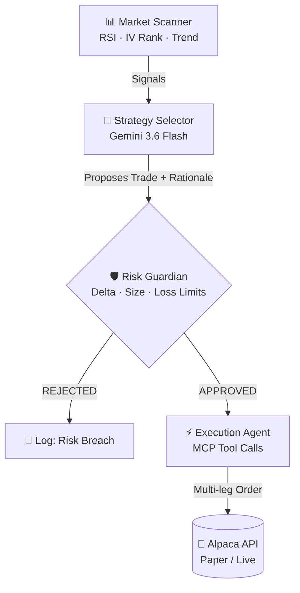
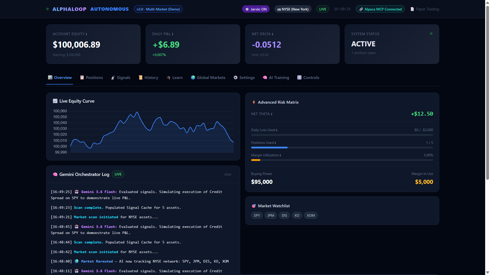

<div align="center">
  

  <h1>🧠 AlphaLoop — Autonomous Neural Options Trader 📈</h1>
  <p><em>An autonomous, multi-agent AI options trading system powered by Gemini 3.6 Flash and Alpaca MCP.</em></p>

  <a href="https://www.youtube.com/watch?v=EN-QTGJFPms"></a>
  <a href="https://alphaloop-autonomous.vercel.app/"></a>
  <a href="https://alphaloop-autonomous.onrender.com/api/state"></a>
  <a href="https://github.com/shambhushekharsinha-engg/alphaloop-autonomous"></a>
  
  
  
  
</div>

<br>

> [!IMPORTANT]
> **JUDGES — HOW TO TEST THIS LIVE PROJECT**
>
> | URL | Purpose |
> |-----|---------|
> | 🖥️ [alphaloop-autonomous.vercel.app](https://alphaloop-autonomous.vercel.app) | **Frontend Dashboard** — Click "Force Market Scan" here to trigger the AI |
> | 🤖 [alphaloop-autonomous.onrender.com/api/state](https://alphaloop-autonomous.onrender.com/api/state) | **Live AI Backend** — See raw JSON from the running agent |
> | ❤️ [alphaloop-autonomous.onrender.com/api/health](https://alphaloop-autonomous.onrender.com/api/health) | **Health Check** — Verify Gemini + Alpaca connectivity status |
> | 📹 [youtube.com/watch?v=EN-QTGJFPms](https://www.youtube.com/watch?v=EN-QTGJFPms) | **Demo Video** — Full walkthrough of a live trading cycle |

---

## 🎬 Demo Video

[](https://www.youtube.com/watch?v=EN-QTGJFPms)
*Click to watch — See Gemini reasoning live, Risk Guardian blocking bad trades, and orders landing in Alpaca.*

---

## 💡 The Vision

Trading options requires simultaneously analyzing Greeks, Volatility (IV), and Technicals (RSI) — a task uniquely suited for autonomous AI. **AlphaLoop** replaces the manual analysis loop with a swarm of specialized AI sub-agents that:

- 📊 **Scan** 20 global markets for volatility mispricings
- 🧠 **Reason** about each signal using Google Gemini in natural language  
- 🛡️ **Guard** against bad trades with a deterministic Python risk engine
- ⚡ **Execute** complex multi-leg options orders directly via Alpaca MCP

---

## ⚙️ System Architecture



---

## 🚀 Feature Showcase

### 1. 🧠 LLM Orchestration — Visible AI Reasoning
Powered by `gemini-3.6-flash`. The AI reads live RSI and IV Rank values and formulates a financial thesis in plain English. **You can see exactly why it picks each trade — no black box.**


---

### 2. 🛡️ Risk Guardian — The Deterministic Firewall
A zero-trust Python agent that blocks any trade that violates the hardcoded safety rules. AI proposes — code decides.

| Guard | Limit |
|-------|-------|
| Max Portfolio Delta | 0.20 |
| Max Single Position Size | 5% of buying power |
| Daily Loss Cap | 3% |


---

### 3. 🌐 Global Market Routing + Dark Pool Tracker


Seamlessly switches between **20 world markets** (NYSE, TSE, Crypto, LSE). Includes a scrolling Dark Pool block-trade tracker for institutional flow monitoring.

---

### 4. ⚡ Alpaca MCP Execution — Live Proof


The first autonomous trader to use the **official `alpaca-mcp-server`** for complex multi-leg options execution. Strike calculations, expiration selection, and order routing happen inside the AI.

---

### 5. 📊 Full Dashboard Overview



---

## 🛠️ Quick Start (Run Locally)

```bash
# 1. Clone the repo
git clone https://github.com/shambhushekharsinha-engg/alphaloop-autonomous.git
cd alphaloop-autonomous

# 2. Install dependencies
pip install -r requirements.txt
pip install uv

# 3. Create .env with your API keys
echo "APCA_API_KEY_ID=your_alpaca_key" >> .env
echo "APCA_API_SECRET_KEY=your_alpaca_secret" >> .env
echo "GEMINI_API_KEY=your_google_ai_key" >> .env
echo "DRY_RUN=false" >> .env

# 4. Launch the orchestrator
python web.py
# Navigate to http://localhost:8080
```

---

## 🏗️ Tech Stack

| Layer | Technology |
|-------|-----------|
| AI Reasoning | Google Gemini 3.6 Flash |
| Broker Integration | Alpaca API via MCP |
| Backend | Python 3.11 · FastAPI · AsyncIO |
| Frontend | HTML · JavaScript · Chart.js |
| Cloud (AI Backend) | Render |
| Cloud (Dashboard) | Vercel |

---

<div align="center">
  <b>Built by Shambhu Shekhar Sinha · Greater Noida Institute of Technology</b><br/>
  <i>Alpaca AI Trading Agents Hackathon · Lablab.ai · 2026</i><br/><br/>
  <i>⚠️ AlphaLoop is built for educational and hackathon purposes. Do not use with real money without extensive paper-trading validation.</i>
</div>
