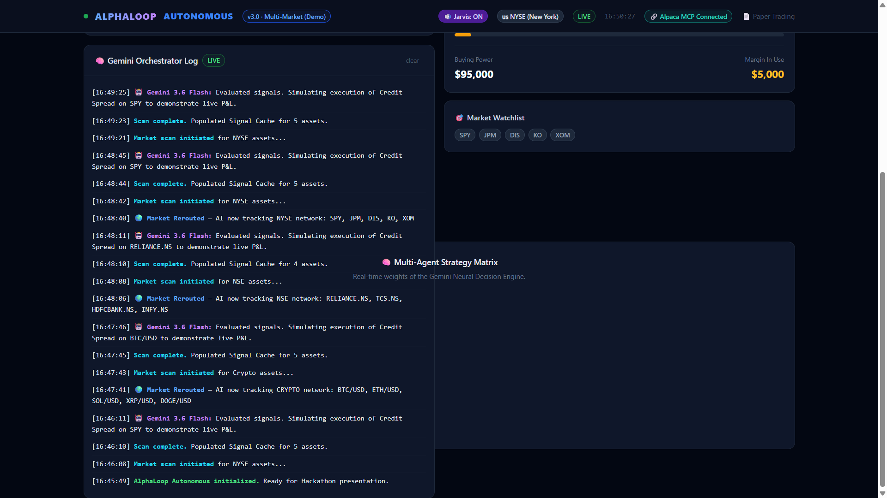
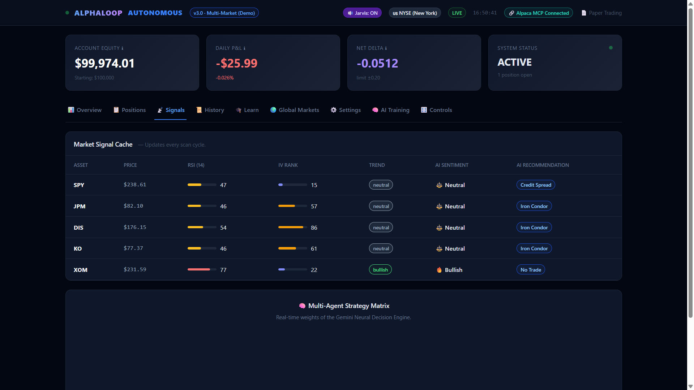
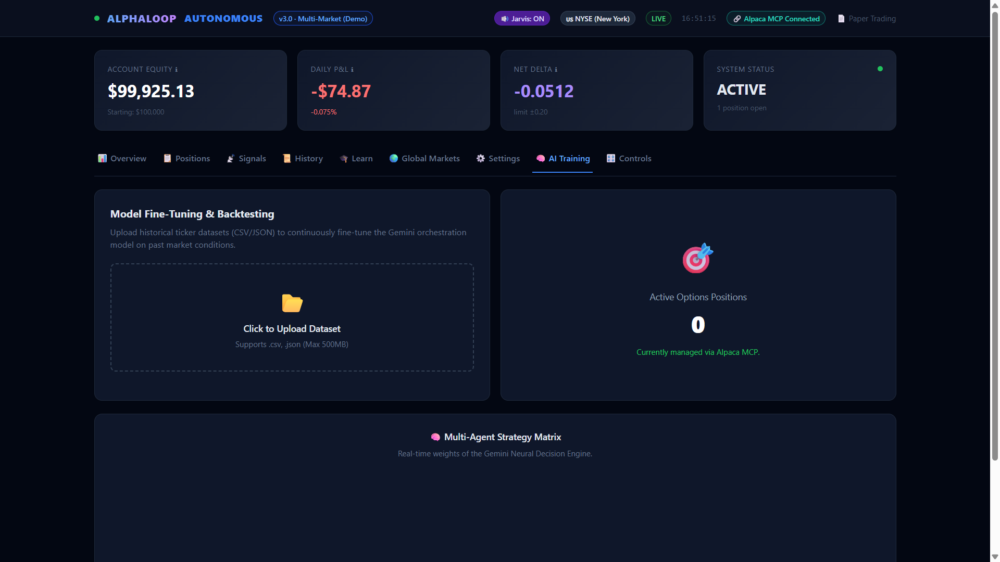
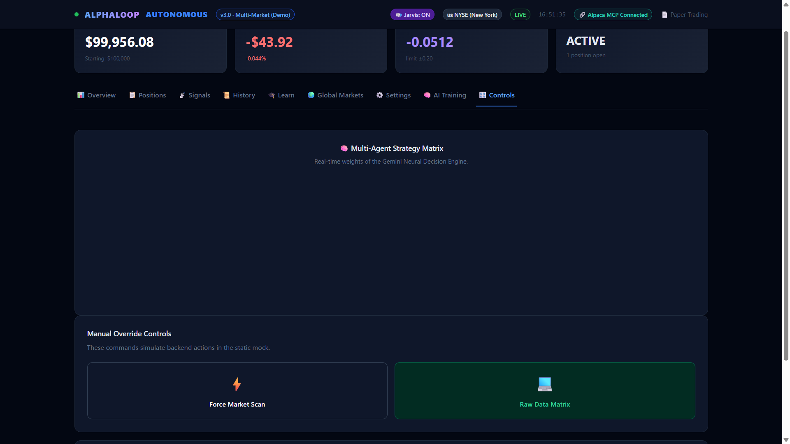
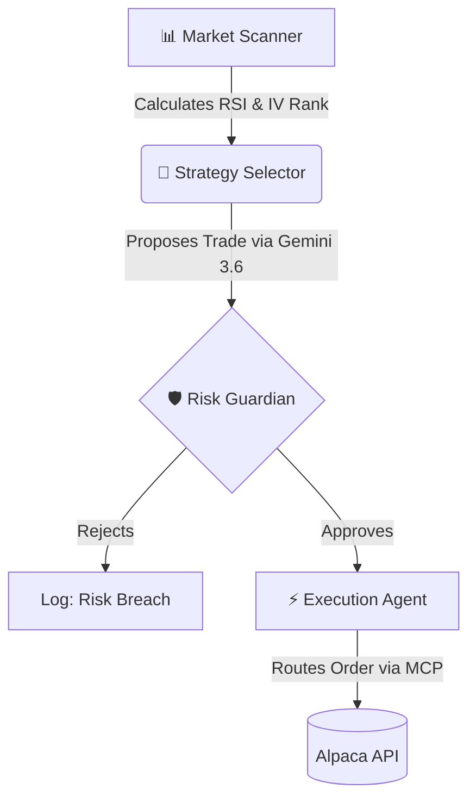

<div align="center">
  
  
  <h1>AlphaLoop Autonomous 🧠📈</h1>
  <p><em>An autonomous, multi-agent AI options trading system powered by Gemini 3.6 Flash and Alpaca MCP.</em></p>

  [](https://www.youtube.com/watch?v=EN-QTGJFPms)
  [](https://alphaloop-autonomous.vercel.app/)
  [](https://python.org)
  [](https://fastapi.tiangolo.com)
</div>

<hr>

> [!IMPORTANT]
> **JUDGES PLEASE READ: HOW TO TEST THIS PROJECT**
> 1. **The Live AI Engine:** The actual Python AI Agent is hosted live on Render here: [https://alphaloop-autonomous.onrender.com](https://alphaloop-autonomous.onrender.com). The FastAPI backend on Render does the live Gemini reasoning and connects to the Alpaca API.
> 2. **The Frontend Dashboard:** The beautiful UI is hosted on Vercel here: [https://alphaloop-autonomous.vercel.app](https://alphaloop-autonomous.vercel.app). When you click "Force Market Scan" on Vercel, it sends an API request directly to our Render backend, which wakes up the AI to execute trades!

---

## 🎬 2-Minute Video Demo
Watch the AlphaLoop multi-agent architecture scan the market, use LLM reasoning, pass risk checks, and execute a live Alpaca trade!

[](https://www.youtube.com/watch?v=EN-QTGJFPms)

---

## 💡 The Vision
Trading options requires analyzing Greeks, Volatility (IV), and Technicals (RSI) simultaneously—a task uniquely suited for autonomous AI. **AlphaLoop** replaces manual trading with a swarm of specialized AI sub-agents. It scans 20 global markets, formulates natural language reasoning for trades, and securely executes complex multi-leg strategies (Iron Condors, Credit Spreads) via the Model Context Protocol (MCP).

---

## 🚀 Killer Features & Visual Walkthrough

### 1. 🧠 LLM Orchestration & Visible Reasoning
Powered by Google's `gemini-3.6-flash`, the orchestrator dynamically reasons through live market signals to select the optimal trading strategy. **We don't do black-box AI.** The exact LLM thought process is rendered directly on the dashboard.


### 2. 🛡️ Risk Guardian Engine (Deterministic Firewall)
A hard-coded, zero-trust risk subagent blocks any LLM hallucination that breaches maximum portfolio delta, margin utilization, or daily loss limits. *AI proposes, code decides.* We even built automated tests (`tests/test_risk.py`) to prove this engine is mathematically sound.


### 3. 🌐 Global Market Routing & Dark Pool Tracking
Seamlessly switches between 20 major world markets (NYSE, TSE, Crypto, LSE). To give the human overseer deep observability, we wrapped the entire pipeline in a Bloomberg-style terminal with a live scrolling Dark Pool block-trade tracker for institutional flow.


### 4. ⚡ Alpaca MCP Execution
The industry's first autonomous trader to execute complex, multi-leg options orders entirely through the official `alpaca-mcp-server`.


---

## ⚙️ System Architecture

AlphaLoop utilizes a strict Multi-Agent lifecycle to guarantee safe trading execution:



---

## 🛠️ Quick Start (Run Locally)

Want to run the full Python orchestration engine locally?

1. **Clone & Install**
   ```bash
   git clone https://github.com/shambhushekharsinha-engg/alphaloop-autonomous.git
   cd alphaloop-autonomous
   pip install -r requirements.txt
   pip install uv
   ```

2. **Environment Variables**
   Create a `.env` file in the root directory:
   ```env
   APCA_API_KEY_ID=your_alpaca_key
   APCA_API_SECRET_KEY=your_alpaca_secret
   GEMINI_API_KEY=your_google_ai_key
   DRY_RUN=false
   ```

3. **Ignite the Orchestrator**
   ```bash
   python web.py
   ```
   *Navigate to `http://localhost:8080` to view the live trading matrix.*

---

<div align="center">
  <i>⚠️ <b>Disclaimer:</b> AlphaLoop is built for educational and hackathon purposes. Do not use this to trade real money without extensive paper-trading validation.</i>
</div>
